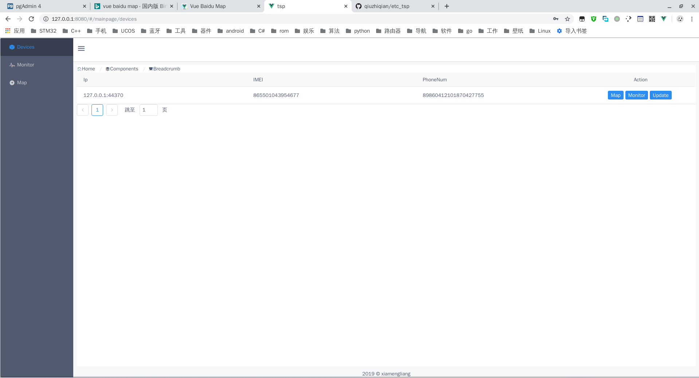
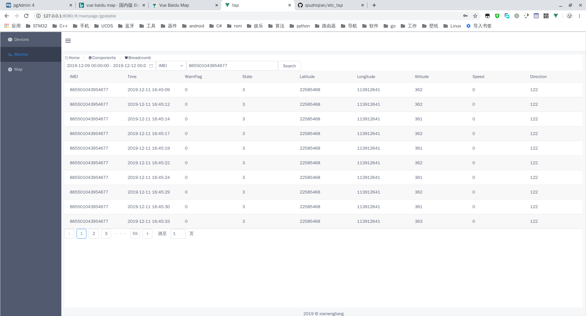
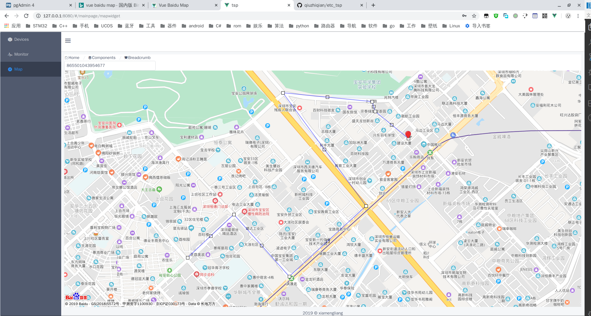

# tsp后台服务

## 预览

登录界面:


主页面包括：设备列表，数据列表以及地图导航

设备列表:


数据列表:


地图导航:


## 编译
```c
$cd frontend

$yarn build

$cd ..

$go build
```

## 技术栈
### 后端
- golang
- gin
- postgresql
- xorm
- jwt

### 前端
- vue
- iview/ant designer
- vue-router
- axios

## 路由
后端路由同一分配到/上面，子页面路由有前端管理

```
/
默认页，被重定向到/#/login

/#/login
登录页面路由

/#/mainpage
主页面路由
```
  
## API
查询在线设备列表
```c
$ curl -H "Content-Type:application/json" -X POST --data '{"page":1}' http://localhost:8080/api/list

{"pagecnt":1,"pagesize":10,"pageindex":1,"data":[{"ip":"127.0.0.1:52388","imei":"865501043954677","phone":"13246607267"},{"ip":"127.0.0.1:52392","imei":"865501043897165","phone":"13246607267"}]}
```

查询设备上报gps数据
```c
$ curl -H "Content-Type:application/json" -X POST --data '{"imei":"865501043954677","starttime":1575453728,"endtime":1575453826,"page":1}' http://localhost:8080/api/data

{"pagecnt":2,"pagesize":10,"pageindex":1,"data":[{"imei":"865501043954677","stamp":1575453733,"warnflag":0,"state":3,"latitude":22585469,"longitude":17222187,"altitude":17409,"speed":23040,"direction":1792},{"imei":"865501043954677","stamp":1575453737,"warnflag":0,"state":3,"latitude":22585462,"longitude":113912645,"altitude":339,"speed":0,"direction":99},{"imei":"865501043954677","stamp":1575453743,"warnflag":0,"state":3,"latitude":22585456,"longitude":113912642,"altitude":326,"speed":0,"direction":99},{"imei":"865501043954677","stamp":1575453748,"warnflag":0,"state":3,"latitude":22585456,"longitude":113912643,"altitude":331,"speed":0,"direction":99},{"imei":"865501043954677","stamp":1575453752,"warnflag":0,"state":3,"latitude":22585456,"longitude":113912643,"altitude":331,"speed":0,"direction":99},{"imei":"865501043954677","stamp":1575453757,"warnflag":0,"state":3,"latitude":22585456,"longitude":113912643,"altitude":331,"speed":0,"direction":99},{"imei":"865501043954677","stamp":1575453762,"warnflag":0,"state":3,"latitude":22585456,"longitude":113912643,"altitude":331,"speed":0,"direction":99},{"imei":"865501043954677","stamp":1575453768,"warnflag":0,"state":3,"latitude":22585456,"longitude":113912645,"altitude":337,"speed":0,"direction":88},{"imei":"865501043954677","stamp":1575453773,"warnflag":0,"state":3,"latitude":22585454,"longitude":113912643,"altitude":338,"speed":0,"direction":134},{"imei":"865501043954677","stamp":1575453778,"warnflag":0,"state":3,"latitude":22585447,"longitude":113912642,"altitude":320,"speed":0,"direction":194}]}

$ curl -H "Content-Type:application/json" -X POST --data '{"imei":"865501043954677","starttime":1575453728,"endtime":1575453826,"page":2}' http://localhost:8080/api/data

{"pagecnt":2,"pagesize":10,"pageindex":2,"data":[{"imei":"865501043954677","stamp":1575453783,"warnflag":0,"state":3,"latitude":22585442,"longitude":113912651,"altitude":315,"speed":0,"direction":194},{"imei":"865501043954677","stamp":1575453788,"warnflag":0,"state":3,"latitude":22585446,"longitude":113912657,"altitude":340,"speed":0,"direction":194},{"imei":"865501043954677","stamp":1575453793,"warnflag":0,"state":3,"latitude":22585447,"longitude":113912659,"altitude":343,"speed":0,"direction":194},{"imei":"865501043954677","stamp":1575453798,"warnflag":0,"state":3,"latitude":22585447,"longitude":113912659,"altitude":345,"speed":0,"direction":194},{"imei":"865501043954677","stamp":1575453803,"warnflag":0,"state":3,"latitude":22585442,"longitude":113912664,"altitude":356,"speed":0,"direction":193},{"imei":"865501043954677","stamp":1575453809,"warnflag":0,"state":3,"latitude":22585447,"longitude":113912669,"altitude":374,"speed":0,"direction":193},{"imei":"865501043954677","stamp":1575453814,"warnflag":0,"state":3,"latitude":22585448,"longitude":113912673,"altitude":366,"speed":0,"direction":149},{"imei":"865501043954677","stamp":1575453818,"warnflag":0,"state":3,"latitude":22585447,"longitude":113912676,"altitude":374,"speed":0,"direction":149},{"imei":"865501043954677","stamp":1575453823,"warnflag":0,"state":3,"latitude":22585446,"longitude":113912678,"altitude":371,"speed":0,"direction":149}]}
```

查询最新的GPS数据，供地图定位
```c
$ curl -H "Content-Type:application/json" -X POST --data '{"imei":"865501043954677"}' http://localhost:8080/api/nowgps 

{"imei":"865501043954677","stamp":1575861194,"warnflag":0,"state":3,"latitude":22585422,"longitude":113912639,"altitude":373,"speed":0,"direction":76}
```

登录验证
```c
curl -H "Content-Type:application/json" -X POST --data '{"user":"1234566","password":"sdfasfdadf"}' http://localhost:8080/api/login

{"token":"xdfasZsdfa2DsJsfa2"}
```