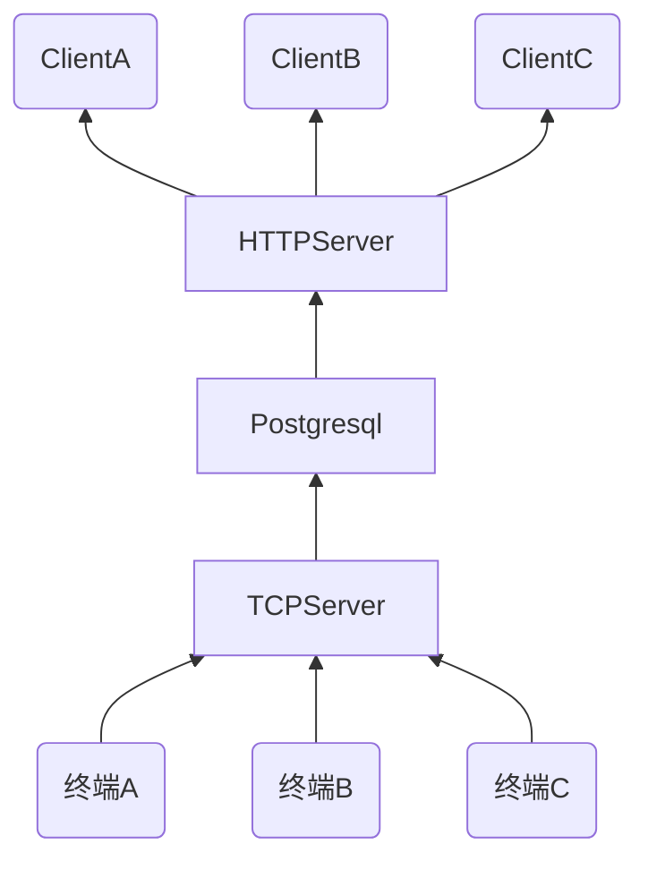

# 一个TCP长连接设备管理后台工程

## 概述

这个项目最初只是用来进行一个简单的协议测试用的，而且是一个纯粹的后端命令行工程。只是后面想着只有命令行，操作也不太方便，于是便有了添加一个ui的想法。

golang项目要配ui，最佳的还是配一个前端界面。而我本人并非前端出生，js功底太差，所以就想着用vue了。而且作为一个技术人员，ui界面设计也比较差，所以就打算找一个现成的ui框架来用，尝试了ant designer和iview后，决定使用iview来实现。

这个工程采用前后端分离设计：

后端采用golang语言，web框架采用gin，数据库采用postgresql，并使用xorm来简化数据库操作。使用jwt来进行权限控制。日志库采用logrus。

前端基本就是vue的生态环境，主体采用vue，ui采用iview，路由使用vur-router，状态管理使用vuex，js请求使用axios库。token存储在localstorage中，暂时没有存储到vuex中。由于前端需要绘制地图轨迹，所以用到了百度地图api和vue的地图库vue-baidu-map

因为页面为单页面，所以页面路由统一由前端来控制，后端只提供一个根路由用来加载静态数据，然后提供若干api供前端获取数据。

### 页面

目前页面只做了5个

- 登录页面

- 设备管理页面
- 数据页面
- 地图轨迹页面
- 用户管理页面

5个页面均由路由控制，网页默认加载到登录页面。

## 预览

登录界面:  


[项目地址](https://github.com/qiuzhiqian/etc_tsp)

## 后端模型




后端需要设计两个服务器，一个TCP，一个HTTP。TCP主要处理与终端的长连接交互，一个TCP连接对应一台终端设备，终端设备唯一标识使用IMEI。HTTP处理与前端的交互，前端需要获取所有可用的终端设备列表，向指定的终端发送命令。所以，为了方便从ip找到对应终端，然后从对应终端找到对应的conn，我们就需要维护一个map：

```go
type Terminal struct {
	authkey   string
	imei      string
	iccid     string
	vin       string
	tboxver   string
	loginTime time.Time
	seqNum    uint16
	phoneNum  string
	Conn      net.Conn
}

var connManger map[string]*Terminal
```

至于为什么要定义成指针的形式，是因为定义成指针后我们可以直接修改map中元素结构体中对应的变量，而不需要重新定义一个元素再赋值。

```go
var connManager map[string]*Terminal
connManager = make(map[string]*Terminal)
connManager["127.0.0.1:11000"]=&Terminal{}
connManager["127.0.0.1:11001"]=&Terminal{}

...

//此处能够轻松的修改对应的phoneNum修改
connManager["127.0.0.1:11001"].phoneNum = "13000000000"
```

相反，下面的这段代码修改起来就要繁琐不少:

```go
var connManager map[string]Terminal
connManager = make(map[string]Terminal)
connManager["127.0.0.1:11000"]=Terminal{}
connManager["127.0.0.1:11001"]=Terminal{}

...
//此处会报错
connManager["127.0.0.1:11001"].phoneNum = "13000000000"

//此处修改需要定义一个临时变量，类似于读改写的模式
term,ok:=connManager["127.0.0.1:11001"]
term.phoneNum = "13000000000"
connManager["127.0.0.1:11001"]=term
```

上面的代码一处会报错

```bash
cannot assign to struct field connManager["127.0.0.1:11001"].phoneNum in map
```

从上面的对比就可以看到，确实是定义成指针更加方便了。

###  TCP的长连接模型

TCP的长连接我们选择这样的一种方式：

- 每个连接分配一个读Goroutine
- 写数据按需分配

如果熟悉socket的话，就知道socket一个服务器创建的基本步骤：

1. 创建socket
2. listen
3. accept

其中accept一般需要轮循调用。golang也基本是同样的流程。

一个简单的TCP服务器示例：

```go
package main

import (
	"fmt"
	"net"
)

type Terminal struct {
	authkey  string
	imei     string
	iccid    string
	vin      string
	tboxver  string
	phoneNum string
	Conn     net.Conn
}

var connManager map[string]*Terminal

func recvConnMsg(conn net.Conn) {
	addr := conn.RemoteAddr()

	var term *Terminal = &Terminal{
		Conn: conn,
	}
	term.Conn = conn
	connManager[addr.String()] = term

	defer func() {
		delete(connManager, addr.String())
		conn.Close()
	}()

	for {
		tempbuf := make([]byte, 1024)
		n, err := conn.Read(tempbuf)

		if err != nil {
			return
		}

		fmt.Println("rcv:", tempbuf[:n])
	}
}

func TCPServer(addr string) {
	connManager = make(map[string]*Terminal)
	listenSock, err := net.Listen("tcp", addr)
	if err != nil {
		return
	}
	defer listenSock.Close()

	for {
		newConn, err := listenSock.Accept()
		if err != nil {
			continue
		}

		go recvConnMsg(newConn)
	}
}

func main() {
	TCPServer(":19903")
}
```

以下是用来测试的客户端代码:

```go
package main

import (
	"fmt"
	"net"
	"time"
)

func main() {
	conn, err := net.Dial("tcp", ":19903")
	if err != nil {
		return
	}

	defer conn.Close()

	var n int = 0
	n, err = conn.Write([]byte("123456"))
	if err != nil {
		return
	}

	fmt.Println("len:", n)

	for {
		time.Sleep(time.Second * 3)
	}
}
```

测试结果:

```bash
$ ./server 
rcv: [49 50 51 52 53 54]
```

## TCP协议整合JTT808协议

前面简单说明了基于golang的net库进行TCP通讯。现在我们需要将现有的协议整合进去。行业内车辆终端一般都是对接交通部的JTT808协议，此处我们要实现的是JTT808-2019版本。

### 消息结构

|标识位|消息头|消息体|校验码|标识位|
| :--: | :--: | :--: | :--: | :--: |
| 0x7e | | | | 0x7e |

标识位应采用0x7e表示，若校验码、消息头以及消息体中出现0x7e及0x7d，则要进行转义处理。转义规则定义如下：

- 先对0x7d进行转义，转换为固定两个字节数据：0x7d 0x01；
- 再对0x7e进行转义，转换为固定两个字节数据：0x7d 0x02。

转义处理过程如下：

发送消息时：先对消息进行封装，然后计算并填充校验码，最后进行转移处理；

接收消息时：先对消息进行转义还原，然后验证校验码，最后解析消息。

示例：发送一包内容为 0x30 0x7e 0x08 0x7d 0x55 的数据包，则经过封装如下：0x7e 0x 30 0x7d 0x02 0x08 0x7d 0x01 0x55 0x7e。

> 注：多字节按照大端顺序传输

### 消息头

| 起始字节 | 字段           | 数据类型 | 描述及要求                                                   |
| -------- | -------------- | -------- | ------------------------------------------------------------ |
| 0        | 消息ID         | WORD     | --                                                           |
| 2        | 消息体属性     | WORD     | 消息体属性格式结构见下表                                     |
| 4        | 协议版本号     | BYTE     | 协议版本号，每次关键修订递增，初始版本为1                    |
| 5        | 终端手机号     | BCD[10]  | 根据安装后终端自身的手机号码转换。手机号不足位的，则在前面补充数字。 |
| 15       | 消息流水号     | WORD     | 按发送顺序从0开始循环累加                                    |
| 17       | 消息包封装选项 | --       | 如果消息体属性中相关标识位确定消息分包处理，则该项有内容，否则无该项 |

消息体属性格式：

| 15   | 14       | 13   | 12~10        | 9~0        |
| ---- | -------- | ---- | ------------ | ---------- |
| 保留 | 版本标识 | 分包 | 数据加密方式 | 消息体长度 |

> 注版本标识位固定为1

加密方式按照如下进行：

- bit10~bit12为数据加密标识位；
- 当此三位为0,标识消息体不加密；
- 当第10位为1,标识消息体经过RSA算法加密；
- 其它位为保留位。

消息分包按照如下要求进行处理：

- 当消息体属性中第13位为1时表示消息体为长消息，进行分包发送处理，具体分包消息由消息包封包项决定；
- 若第13位为0,则消息头中无消息包封装项字段。

消息包封装项内容：

| 起始字节 | 字段       | 数据内容 | 描述及要求           |
| -------- | ---------- | -------- | -------------------- |
| 0        | 消息总包数 | WORD     | 该消息分包后的总包数 |
| 2        | 包序号     | WORD     | 从1开始              |

### 校验码

校验码的计算规则应从消息头首字节开始，同后一字节进行异或操纵直到消息体末字节结束；校
验码长度为一字节。

### 消息体

消息体只需要实现以下几个命令即可：

| 命令         | 消息ID | 说明                       |
| ------------ | ------ | -------------------------- |
| 终端通用应答 | 0x0001 | 终端通用应答               |
| 平台通用应答 | 0x8001 | 平台通用应答               |
| 终端心跳     | 0x0002 | 消息体为空，应答为通用应答 |
| 终端注册     | 0x0100 |                            |
| 终端注册应答 | 0x8100 |                            |
| 终端鉴权     | 0x0102 | 应答为通用应答             |
| 位置信息     | 0x0200 | 应答为通用应答             |

#### 数据格式

终端通用应答：

| 起始字节 | 字段       | 数据内容 | 描述及要求                               |
| -------- | ---------- | -------- | ---------------------------------------- |
| 0        | 应答流水号 | WORD     | 该消息分包后的总包数                     |
| 2        | 应答ID     | WORD     | 对应的平台消息的ID                       |
| 4        | 结果       | BYTE     | 0：成功/确认;1：失败;2消息有误;3：不支持 |

平台通用应答：

| 起始字节 | 字段       | 数据内容 | 描述及要求                                               |
| -------- | ---------- | -------- | -------------------------------------------------------- |
| 0        | 应答流水号 | WORD     | 对应的终端消息流水号                                     |
| 2        | 应答ID     | WORD     | 对应的终端消息的ID                                       |
| 4        | 结果       | BYTE     | 0：成功/确认;1：失败;2消息有误;3：不支持;4：报警处理确认 |

终端注册：

| 起始字节 | 字段       | 数据内容 | 描述及要求                                               |
| -------- | ---------- | -------- | -------------------------------------------------------- |
| 0        | 应答流水号 | WORD     | 对应的终端消息流水号                                     |
| 2        | 应答ID     | WORD     | 对应的终端消息的ID                                       |
| 4        | 结果       | BYTE     | 0：成功/确认;1：失败;2消息有误;3：不支持;4：报警处理确认 |

终端注册应答：

| 起始字节 | 字段       | 数据内容 | 描述及要求                                                   |
| -------- | ---------- | -------- | ------------------------------------------------------------ |
| 0        | 应答流水号 | WORD     | 对应的终端注册消息的流水号                                   |
| 2        | 结果       | BYTE     | 0:成功;1:车辆已被注册;2:数据库中无该车辆;3终端已被注册;4数据库中无该终端 |
| 3        | 鉴权码     | STRING   | 注册结果为成功时，才有该字段                                 |

鉴权：

| 起始字节 | 字段       | 数据内容 | 描述及要求                                            |
| -------- | ---------- | -------- | ----------------------------------------------------- |
| 0        | 鉴权码长度 | BYTE     | ---                                                   |
| n        | 结果       | STRING   | n为鉴权码长度                                         |
| n+1      | 终端IMEI   | BYTE[15] | ---                                                   |
| n+16     | 软件版本号 | BYTE[20] | 厂家自定义版本号，位数不足时，后补0x00，n为鉴权码长度 |

以上就是需要实现的808协议内容，从协议中可以看到。对于协议实现，为了后续拓展方便，我们需要将它分割成两个基本部分：协议解析和协议处理。

## 协议解析

从前面内容我们可以发现，808协议是一个很典型的协议格式：

```
固定字段+变长字段
```

其中固定字段用来检测一个帧格式的完整性和有效性，所以一般会包含一下内容：帧头+变长字段对应的长度+校验。由于这一段的数据格式固定，目的单一，所以处理起来比较简单。

变长字段的长度是由固定字段终端某一个子字段的值决定的，而且这部分的格式比较多变，需要灵活处理。这一字段我们通常称为Body或者Apdu。

我们首先说明变长字段的处理流程。

### Body处理

正因为Body字段格式灵活，所以为了提高代码的复用性和拓展性，我们需要对Body的处理机制进行抽象，提取出一个相对通用的接口出来。

有经验的工程师都知道，一个协议格式处理，无非就是编码和解码。编码我们称之为Marshal，解码我们称之为Unmarshal。对于不同的格式，我们只需要提供不同的Marshal和Unmarshal实现即可。


从前面分析可以知道，我们现在面对的一种格式是类似于Plain的格式，这种格式没有基本的分割符，下面我们就对这种编码来实现Marshal和Unmarshal。我们将这部分逻辑定义为一个codec包

```go
package codec

func Unmarshal(data []byte, v interface{}) (int, error){}
func Marshal(v interface{}) ([]byte, error){}
```

参考官方库解析json的流程，很快我们就想到了用反射来实现这两个功能。

首先我们来分析Unmarshal，我们需要按照v的类型，将data数据按照对应的长度和类型赋值。举个最简单的例子:

```go
func TestSimple(t *testing.T) {
	type Body struct {
		Age1 int8
		Age2 int16
	}

	data := []byte{0x01, 0x02, 0x03}
	pack := Body{}
	i, err := Unmarshal(data, &pack)
	if err != nil {
		t.Errorf("err:%s", err.Error())
	}

	t.Log("len:", i)
	t.Log("pack:", pack)
}
```

```bash
$ go test -v server/codec -run TestSimple
=== RUN   TestSimple
--- PASS: TestSimple (0.00s)
    codec_test.go:20: len: 3
    codec_test.go:21: pack: {1 515}
PASS
ok      server/codec    0.002s
```

对于Body结构体，第一个字段是int8，占用一个字节，所以分配的值是0x01。第二个字段是int16，占用两个字节，分配的值是0x02,0x03，然后把这两个字节按照大端格式组合成一个int16就行了。所以结果就是Age1字段为1(0x01)，Age2字段为515(0x0203)

所以处理的关键是，我们要识别出v interface{}的类型，然后计算该类型对应的大小，再将data中对应大小的数据段组合成对应类型值复制给v中的对应字段。

v interface{}的类型多变，可能会涉及到结构体嵌套等，所以会存在递归处理，当然第一步我们需要获取到v的类型：

```go
rv := reflect.ValueOf(v)
switch rv.Kind() {
    case reflect.Int8:
		//
	case reflect.Uint8:
		//
	case reflect.Int16:
		//
	case reflect.Uint16:
		//
	case reflect.Int32:
		//
	case reflect.Uint32:
		//
	case reflect.Int64:
		//
	case reflect.Uint64:
		//
	case reflect.Float32:
    	//
    case reflect.Float64:
		//
	case reflect.String:
		//
	case reflect.Slice:
		//
	case reflect.Struct:
    	//需要对struct中的每个元素进行解析
}
```

其他的类型都比较好处理，需要说明的是struct类型，首先我们要能够遍历struct中的各个元素，于是我们找到了：

```go
fieldCount := v.NumField()
v.Field(i)
```

NumField()能够获取结构体内部元素个数，然后Field(i)通过指定index就可以获取到指定的元素了。获取到了元素后，我们就需要最这个元素进行再次的Unmarshal，也就是递归。但是此时我们通过v.Field(i)获取到的是reflect.Value类型，而不是interface{}类型了，所以递归的入参我们使用reflect.Value。另外还需要考虑的一个问题是data数据的索引问题，一次调用Unmarshal就会**消耗掉**一定字节的data数据，消耗的长度应该能够被获取到，以方便下一次调用Unmarshal时，能够对入参的data数据索引做正确的设定。因此，Unmarshal函数需要返回一个当前当用后所占用的字节长度。比如int8就是一个字节，struct就是各个字段字节之和。

```go
func Unmarshal(data []byte, v interface{})  (int,error) {
	rv := reflect.ValueOf(v)
	if rv.Kind() != reflect.Ptr || rv.IsNil() {
		return 0,fmt.Errorf("error")
	}

	return refUnmarshal(data, reflect.ValueOf(v))
}

func refUnmarshal(data []byte, v reflect.Value)  (int,error) {
	var usedLen int = 0
	if v.Kind() == reflect.Ptr {
		v = v.Elem()
	}
	switch v.Kind() {
	case reflect.Int8:
		usedLen = usedLen + 1
	case reflect.Uint8:
		usedLen = usedLen + 1
	case reflect.Int16:
		if len(data) < 2 {
			return 0, fmt.Errorf("data to short")
		}
		usedLen = usedLen + 2
	case reflect.Uint16:
		if len(data) < 2 {
			return 0, fmt.Errorf("data to short")
		}
		usedLen = usedLen + 2
	case reflect.Int32:
		if len(data) < 4 {
			return 0, fmt.Errorf("data to short")
		}
		usedLen = usedLen + 4
	case reflect.Uint32:
		if len(data) < 4 {
			return 0, fmt.Errorf("data to short")
		}
		usedLen = usedLen + 4
	case reflect.Int64:
		usedLen = usedLen + 8
	case reflect.Uint64:
		usedLen = usedLen + 8
	case reflect.Float32:
		usedLen = usedLen + 4
	case reflect.Float64:
		usedLen = usedLen + 8
	case reflect.String:
		//待处理
	case reflect.Slice:
		//待处理
	case reflect.Struct:
		fieldCount := v.NumField()

		for i := 0; i < fieldCount; i++ {
			l, err := refUnmarshal(data[usedLen:], v.Field(i), v.Type().Field(i), streLen)
			if err != nil {
				return 0, err
			}

			usedLen = usedLen + l
		}
	}
	return usedLen, nil
}
```

解析到这个地方我们发现，我们又遇到了另外的一个问题：我们没有办法单纯的通过类型来获取到string和struct的长度，而且我们还必须处理这两个类型，因为这两个类型在协议处理中是很常见的。既然单纯的通过类型无法判断长度，我们就要借助tag了。我们尝试着在string和slice上设定tag来解决这个问题。但是tag是属于结构体的，只有结构体内部元素才能拥有tag，而且我们不能通过元素本身获取tag，必须通过上层的struct的type才能获取到，所以此时我们入参还要加入一个通过结构体type获取到的对应字段reflect.StructField：

```go
func refUnmarshal(data []byte, v reflect.Value, tag reflect.StructField) (int, error) {
	var usedLen int = 0
	if v.Kind() == reflect.Ptr {
		v = v.Elem()
	}
	switch v.Kind() {
	case reflect.Int8:
		usedLen = usedLen + 1
	case reflect.Uint8:
		usedLen = usedLen + 1
	case reflect.Int16:
		usedLen = usedLen + 2
	case reflect.Uint16:
		usedLen = usedLen + 2
	case reflect.Int32:
		usedLen = usedLen + 4
	case reflect.Uint32:
		usedLen = usedLen + 4
	case reflect.Int64:
		usedLen = usedLen + 8
	case reflect.Uint64:
		usedLen = usedLen + 8
	case reflect.Float32:
		usedLen = usedLen + 4
	case reflect.Float64:
		usedLen = usedLen + 8
	case reflect.String:
		strLen := tag.Tag.Get("len")
		var lens int = 0
		if strLen == "" {
			//
		} else {
			lens64, err := strconv.ParseInt(strLen, 10, 0)
			if err != nil {
				return 0, err
			}

			lens = int(lens64)
		}
		usedLen = usedLen + int(lens)
	case reflect.Slice:
		strLen := tag.Tag.Get("len")
		var lens int = 0
		if strLen == "" {
			//
		} else {
			lens64, err := strconv.ParseInt(strLen, 10, 0)
			if err != nil {
				return 0, err
			}

			lens = int(lens64)
		}

		usedLen = usedLen + int(lens)
	case reflect.Struct:
		fieldCount := v.NumField()

		for i := 0; i < fieldCount; i++ {
			l, err := refUnmarshal(data[usedLen:], v.Field(i), v.Type().Field(i))
			if err != nil {
				return 0, err
			}

			usedLen = usedLen + l
		}
	}
	return usedLen, nil
}
```

这样我们就能过获取到所有的字段对应的长度了，这个很关键。然后我们只需要根据对应的长度，从data中填充对应的数据值即可

```go
func refUnmarshal(data []byte, v reflect.Value, tag reflect.StructField) (int, error) {
	var usedLen int = 0
	if v.Kind() == reflect.Ptr {
		v = v.Elem()
	}
	switch v.Kind() {
	case reflect.Int8:
		v.SetInt(int64(data[0]))
		usedLen = usedLen + 1
	case reflect.Uint8:
		v.SetUint(uint64(data[0]))
		usedLen = usedLen + 1
	case reflect.Int16:
		if len(data) < 2 {
			return 0, fmt.Errorf("data to short")
		}
		v.SetInt(int64(Bytes2Word(data)))
		usedLen = usedLen + 2
	case reflect.Uint16:
		if len(data) < 2 {
			return 0, fmt.Errorf("data to short")
		}
		v.SetUint(uint64(Bytes2Word(data)))
		usedLen = usedLen + 2
	case reflect.Int32:
		if len(data) < 4 {
			return 0, fmt.Errorf("data to short")
		}
		v.SetInt(int64(Bytes2DWord(data)))
		usedLen = usedLen + 4
	case reflect.Uint32:
		if len(data) < 4 {
			return 0, fmt.Errorf("data to short")
		}
		v.SetUint(uint64(Bytes2DWord(data)))
		usedLen = usedLen + 4
	case reflect.Int64:
		v.SetInt(64)
		usedLen = usedLen + 8
	case reflect.Uint64:
		v.SetUint(64)
		usedLen = usedLen + 8
	case reflect.Float32:
		v.SetFloat(32.23)
		usedLen = usedLen + 4
	case reflect.Float64:
		v.SetFloat(64.46)
		usedLen = usedLen + 8
	case reflect.String:
		strLen := tag.Tag.Get("len")
		var lens int = 0
		if strLen == "" {
			//
		} else {
			lens64, err := strconv.ParseInt(strLen, 10, 0)
			if err != nil {
				return 0, err
			}

			lens = int(lens64)
		}

		if len(data) < int(lens) {
			return 0, fmt.Errorf("data to short")
		}

		v.SetString(string(data[:lens]))
		usedLen = usedLen + int(lens)

	case reflect.Slice:
		strLen := tag.Tag.Get("len")
		var lens int = 0
		if strLen == "" {
			//
		} else {
			lens64, err := strconv.ParseInt(strLen, 10, 0)
			if err != nil {
				return 0, err
			}

			lens = int(lens64)
		}

		v.SetBytes(data[:lens])
		usedLen = usedLen + int(lens)
	case reflect.Struct:
		fieldCount := v.NumField()

		for i := 0; i < fieldCount; i++ {
			l, err := refUnmarshal(data[usedLen:], v.Field(i), v.Type().Field(i))
			if err != nil {
				return 0, err
			}

			usedLen = usedLen + l
		}
	}
	return usedLen, nil
}
```

一个基本的Unmarshal函数就完成了。但是这个处理是比较理想的，在实际中可能会存在这样的一种情况：在一个协议中有若干字段，其他的字段都是固定长度，只有一个字段是长度可变的，而这个可变长度的计算是由总体长度-固定长度来计算出来的。在这种情况下，我们需要提前计算出已知字段的固定长度，然后用data长度-固定长度，得到唯一的可变字段的长度。所以我现在要有一个获取这个结构的有效长度的函数。前面的Unmarshal内部已经可以获取到每个字段的长度了，我们只需要把这个函数简单改造一下就行了：

```go
func RequireLen(v interface{}) (int, error) {
	rv := reflect.ValueOf(v)
	if rv.Kind() != reflect.Ptr || rv.IsNil() {
		return 0, fmt.Errorf("error")
	}

	return refRequireLen(reflect.ValueOf(v), reflect.StructField{})
}

func refRequireLen(v reflect.Value, tag reflect.StructField) (int, error) {
	var usedLen int = 0
	if v.Kind() == reflect.Ptr {
		v = v.Elem()
	}
	switch v.Kind() {
	case reflect.Int8:
		usedLen = usedLen + 1
	case reflect.Uint8:
		usedLen = usedLen + 1
	case reflect.Int16:
		usedLen = usedLen + 2
	case reflect.Uint16:
		usedLen = usedLen + 2
	case reflect.Int32:
		usedLen = usedLen + 4
	case reflect.Uint32:
		usedLen = usedLen + 4
	case reflect.Int64:
		usedLen = usedLen + 8
	case reflect.Uint64:
		usedLen = usedLen + 8
	case reflect.Float32:
		usedLen = usedLen + 4
	case reflect.Float64:
		usedLen = usedLen + 8
	case reflect.String:
		strLen := tag.Tag.Get("len")
		if strLen == "" {
			return 0, nil
		}
		lens, err := strconv.ParseInt(strLen, 10, 0)
		if err != nil {
			return 0, err
		}

		usedLen = usedLen + int(lens)
	case reflect.Slice:
		strLen := tag.Tag.Get("len")
		if strLen == "" {
			return 0, nil
		}
		lens, err := strconv.ParseInt(strLen, 10, 0)
		if err != nil {
			return 0, err
		}

		usedLen = usedLen + int(lens)
	case reflect.Struct:
		fieldCount := v.NumField()

		for i := 0; i < fieldCount; i++ {
			l, err := refRequireLen(v.Field(i), v.Type().Field(i))
			if err != nil {
				return 0, err
			}

			usedLen = usedLen + l
		}
	}
	return usedLen, nil
}
```

这样我们就可以实现一个完整的Unmarshal

```go
func Unmarshal(data []byte, v interface{}) (int, error) {
	rv := reflect.ValueOf(v)
	if rv.Kind() != reflect.Ptr || rv.IsNil() {
		return 0, fmt.Errorf("error")
	}

	lens, err := RequireLen(v)
	if err != nil {
		return 0, err
	}

	if len(data) < lens {
		return 0, fmt.Errorf("data too short")
	}

	return refUnmarshal(data, reflect.ValueOf(v), reflect.StructField{}, len(data)-lens)
}

func refUnmarshal(data []byte, v reflect.Value, tag reflect.StructField, streLen int) (int, error) {
	var usedLen int = 0
	if v.Kind() == reflect.Ptr {
		v = v.Elem()
	}
	switch v.Kind() {
	case reflect.Int8:
		v.SetInt(int64(data[0]))
		usedLen = usedLen + 1
	case reflect.Uint8:
		v.SetUint(uint64(data[0]))
		usedLen = usedLen + 1
	case reflect.Int16:
		if len(data) < 2 {
			return 0, fmt.Errorf("data to short")
		}
		v.SetInt(int64(Bytes2Word(data)))
		usedLen = usedLen + 2
	case reflect.Uint16:
		if len(data) < 2 {
			return 0, fmt.Errorf("data to short")
		}
		v.SetUint(uint64(Bytes2Word(data)))
		usedLen = usedLen + 2
	case reflect.Int32:
		if len(data) < 4 {
			return 0, fmt.Errorf("data to short")
		}
		v.SetInt(int64(Bytes2DWord(data)))
		usedLen = usedLen + 4
	case reflect.Uint32:
		if len(data) < 4 {
			return 0, fmt.Errorf("data to short")
		}
		v.SetUint(uint64(Bytes2DWord(data)))
		usedLen = usedLen + 4
	case reflect.Int64:
		v.SetInt(64)
		usedLen = usedLen + 8
	case reflect.Uint64:
		v.SetUint(64)
		usedLen = usedLen + 8
	case reflect.Float32:
		v.SetFloat(32.23)
		usedLen = usedLen + 4
	case reflect.Float64:
		v.SetFloat(64.46)
		usedLen = usedLen + 8
	case reflect.String:
		strLen := tag.Tag.Get("len")
		var lens int = 0
		if strLen == "" {
			lens = streLen
		} else {
			lens64, err := strconv.ParseInt(strLen, 10, 0)
			if err != nil {
				return 0, err
			}

			lens = int(lens64)
		}

		if len(data) < int(lens) {
			return 0, fmt.Errorf("data to short")
		}

		v.SetString(string(data[:lens]))
		usedLen = usedLen + int(lens)

	case reflect.Slice:
		strLen := tag.Tag.Get("len")
		var lens int = 0
		if strLen == "" {
			lens = streLen
		} else {
			lens64, err := strconv.ParseInt(strLen, 10, 0)
			if err != nil {
				return 0, err
			}

			lens = int(lens64)
		}

		v.SetBytes(data[:lens])
		usedLen = usedLen + int(lens)
	case reflect.Struct:
		fieldCount := v.NumField()

		for i := 0; i < fieldCount; i++ {
			l, err := refUnmarshal(data[usedLen:], v.Field(i), v.Type().Field(i), streLen)
			if err != nil {
				return 0, err
			}

			usedLen = usedLen + l
		}
	}
	return usedLen, nil
}
```

理解了上面的流程，Marshal就就很好写了，只是复制过程反过来就行了。这其中还有一些小的转换逻辑将字节数组转换成多字节整形：Bytes2Word、Word2Bytes、Bytes2DWord、Dword2Bytes。这类转换都使用大端格式处理。完整代码如下：

```go
package codec

import (
	"fmt"
	"reflect"
	"strconv"
)

func RequireLen(v interface{}) (int, error) {
	rv := reflect.ValueOf(v)
	if rv.Kind() != reflect.Ptr || rv.IsNil() {
		return 0, fmt.Errorf("error")
	}

	return refRequireLen(reflect.ValueOf(v), reflect.StructField{})
}

func Unmarshal(data []byte, v interface{}) (int, error) {
	rv := reflect.ValueOf(v)
	if rv.Kind() != reflect.Ptr || rv.IsNil() {
		return 0, fmt.Errorf("error")
	}

	lens, err := RequireLen(v)
	if err != nil {
		return 0, err
	}

	if len(data) < lens {
		return 0, fmt.Errorf("data too short")
	}

	return refUnmarshal(data, reflect.ValueOf(v), reflect.StructField{}, len(data)-lens)
}

func Marshal(v interface{}) ([]byte, error) {
	rv := reflect.ValueOf(v)
	if rv.Kind() != reflect.Ptr || rv.IsNil() {
		return []byte{}, fmt.Errorf("error")
	}

	return refMarshal(reflect.ValueOf(v), reflect.StructField{})
}

func refRequireLen(v reflect.Value, tag reflect.StructField) (int, error) {
	var usedLen int = 0
	if v.Kind() == reflect.Ptr {
		v = v.Elem()
	}
	switch v.Kind() {
	case reflect.Int8:
		usedLen = usedLen + 1
	case reflect.Uint8:
		usedLen = usedLen + 1
	case reflect.Int16:
		usedLen = usedLen + 2
	case reflect.Uint16:
		usedLen = usedLen + 2
	case reflect.Int32:
		usedLen = usedLen + 4
	case reflect.Uint32:
		usedLen = usedLen + 4
	case reflect.Int64:
		usedLen = usedLen + 8
	case reflect.Uint64:
		usedLen = usedLen + 8
	case reflect.Float32:
		usedLen = usedLen + 4
	case reflect.Float64:
		usedLen = usedLen + 8
	case reflect.String:
		strLen := tag.Tag.Get("len")
		if strLen == "" {
			return 0, nil
		}
		lens, err := strconv.ParseInt(strLen, 10, 0)
		if err != nil {
			return 0, err
		}

		usedLen = usedLen + int(lens)
	case reflect.Slice:
		strLen := tag.Tag.Get("len")
		if strLen == "" {
			return 0, nil
		}
		lens, err := strconv.ParseInt(strLen, 10, 0)
		if err != nil {
			return 0, err
		}

		usedLen = usedLen + int(lens)
	case reflect.Struct:
		fieldCount := v.NumField()

		for i := 0; i < fieldCount; i++ {
			l, err := refRequireLen(v.Field(i), v.Type().Field(i))
			if err != nil {
				return 0, err
			}

			usedLen = usedLen + l
		}
	}
	return usedLen, nil
}

func refUnmarshal(data []byte, v reflect.Value, tag reflect.StructField, streLen int) (int, error) {
	var usedLen int = 0
	if v.Kind() == reflect.Ptr {
		v = v.Elem()
	}
	switch v.Kind() {
	case reflect.Int8:
		v.SetInt(int64(data[0]))
		usedLen = usedLen + 1
	case reflect.Uint8:
		v.SetUint(uint64(data[0]))
		usedLen = usedLen + 1
	case reflect.Int16:
		if len(data) < 2 {
			return 0, fmt.Errorf("data to short")
		}
		v.SetInt(int64(Bytes2Word(data)))
		usedLen = usedLen + 2
	case reflect.Uint16:
		if len(data) < 2 {
			return 0, fmt.Errorf("data to short")
		}
		v.SetUint(uint64(Bytes2Word(data)))
		usedLen = usedLen + 2
	case reflect.Int32:
		if len(data) < 4 {
			return 0, fmt.Errorf("data to short")
		}
		v.SetInt(int64(Bytes2DWord(data)))
		usedLen = usedLen + 4
	case reflect.Uint32:
		if len(data) < 4 {
			return 0, fmt.Errorf("data to short")
		}
		v.SetUint(uint64(Bytes2DWord(data)))
		usedLen = usedLen + 4
	case reflect.Int64:
		v.SetInt(64)
		usedLen = usedLen + 8
	case reflect.Uint64:
		v.SetUint(64)
		usedLen = usedLen + 8
	case reflect.Float32:
		v.SetFloat(32.23)
		usedLen = usedLen + 4
	case reflect.Float64:
		v.SetFloat(64.46)
		usedLen = usedLen + 8
	case reflect.String:
		strLen := tag.Tag.Get("len")
		var lens int = 0
		if strLen == "" {
			lens = streLen
		} else {
			lens64, err := strconv.ParseInt(strLen, 10, 0)
			if err != nil {
				return 0, err
			}

			lens = int(lens64)
		}

		if len(data) < int(lens) {
			return 0, fmt.Errorf("data to short")
		}

		v.SetString(string(data[:lens]))
		usedLen = usedLen + int(lens)

	case reflect.Slice:
		strLen := tag.Tag.Get("len")
		var lens int = 0
		if strLen == "" {
			lens = streLen
		} else {
			lens64, err := strconv.ParseInt(strLen, 10, 0)
			if err != nil {
				return 0, err
			}

			lens = int(lens64)
		}

		v.SetBytes(data[:lens])
		usedLen = usedLen + int(lens)
	case reflect.Struct:
		fieldCount := v.NumField()

		for i := 0; i < fieldCount; i++ {
			l, err := refUnmarshal(data[usedLen:], v.Field(i), v.Type().Field(i), streLen)
			if err != nil {
				return 0, err
			}

			usedLen = usedLen + l
		}
	}
	return usedLen, nil
}

func refMarshal(v reflect.Value, tag reflect.StructField) ([]byte, error) {
	data := make([]byte, 0)
	if v.Kind() == reflect.Ptr {
		v = v.Elem()
	}
	switch v.Kind() {
	case reflect.Int8:
		data = append(data, byte(v.Int()))
	case reflect.Uint8:
		data = append(data, byte(v.Uint()))
	case reflect.Int16:
		temp := Word2Bytes(uint16(v.Int()))
		data = append(data, temp...)
	case reflect.Uint16:
		temp := Word2Bytes(uint16(v.Uint()))
		data = append(data, temp...)
	case reflect.Int32:
		temp := Dword2Bytes(uint32(v.Int()))
		data = append(data, temp...)
	case reflect.Uint32:
		temp := Dword2Bytes(uint32(v.Uint()))
		data = append(data, temp...)
	case reflect.String:
		strLen := tag.Tag.Get("len")
		lens, err := strconv.ParseInt(strLen, 10, 0)
		if err != nil {
			return []byte{}, err
		}

		if int(lens) > v.Len() {
			zeroSlice := make([]byte, int(lens)-v.Len())
			data = append(data, zeroSlice...)
		}
		data = append(data, v.String()...)
	case reflect.Slice:
		strLen := tag.Tag.Get("len")
		lens, err := strconv.ParseInt(strLen, 10, 0)
		if err != nil {
			return []byte{}, err
		}

		if int(lens) > v.Len() {
			zeroSlice := make([]byte, int(lens)-v.Len())
			data = append(data, zeroSlice...)
		}
		data = append(data, v.Bytes()...)
	case reflect.Struct:
		fieldCount := v.NumField()

		for i := 0; i < fieldCount; i++ {
			fmt.Println(v.Field(i).Type().String())
			d, err := refMarshal(v.Field(i), v.Type().Field(i))
			if err != nil {
				return []byte{}, err
			}

			data = append(data, d...)
		}
	}
	return data, nil
}

func Bytes2Word(data []byte) uint16 {
	if len(data) < 2 {
		return 0
	}
	return (uint16(data[0]) << 8) + uint16(data[1])
}

func Word2Bytes(data uint16) []byte {
	buff := make([]byte, 2)
	buff[0] = byte(data >> 8)
	buff[1] = byte(data)
	return buff
}

func Bytes2DWord(data []byte) uint32 {
	if len(data) < 4 {
		return 0
	}
	return (uint32(data[0]) << 24) + (uint32(data[1]) << 16) + (uint32(data[2]) << 8) + uint32(data[3])
}

func Dword2Bytes(data uint32) []byte {
	buff := make([]byte, 4)
	buff[0] = byte(data >> 24)
	buff[1] = byte(data >> 16)
	buff[2] = byte(data >> 8)
	buff[3] = byte(data)
	return buff
}
```

## 帧过滤器

帧过滤器的作用就是，从接收到的buff中，过滤出有效的完整jtt808数据包。由于是tcp通讯，那么这其中不可避免的会涉及到数据包的两个常规处理：拆包和粘包。

拆包和粘包的简要说明：

```
假设客户端分别发送了两个数据包D1和D2给服务端，由于服务端一次读取到的字节数是不确定的，故可能存在以下4种情况。

（1）服务端分两次读取到了两个独立的数据包，分别是D1和D2，没有粘包和拆包；

（2）服务端一次接收到了两个数据包，D1和D2粘合在一起，被称为TCP粘包；

（3）服务端分两次读取到了两个数据包，第一次读取到了完整的D1包和D2包的部分内容，第二次读取到了D2包的剩余内容，这被称为TCP拆包；

（4）服务端分两次读取到了两个数据包，第一次读取到了D1包的部分内容D1_1，第二次读取到了D1包的剩余内容D1_2和D2包的整包。

如果此时服务端TCP接收滑窗非常小，而数据包D1和D2比较大，很有可能会发生第五种可能，即服务端分多次才能将D1和D2包接收完全，期间发生多次拆包。
```

拆包与粘包的说明网上资料很多，此处不做过多说明。但是我们设计出来的过滤器，要能够正常应对拆包和粘包的情况。

首先，我们根据jtt808协议定义我们的数据包结构：

```go
type MultiField struct {
	MsgSum   uint16
	MsgIndex uint16
}

type Header struct {
	MID       uint16
	Attr      uint16
	Version   uint8
	PhoneNum  string
	SeqNum    uint16
	MutilFlag MultiField
}

type Message struct {
	HEADER Header
	BODY   []byte
}
```

由于Attr其实是由多个位域字段组成，所以我们再定义三个函数：

```go
func (h *Header) IsMulti() bool {
	if ((h.Attr >> 12) & 0x0001) > 0 {
		return true
	}
	return false
}

//BodyLen is a function for get body len
func (h *Header) BodyLen() int {
	return int(h.Attr & 0x03ff)
}

//MakeAttr is generate attr
func MakeAttr(verFlag byte, mut bool, enc byte, lens uint16) uint16 {
	attr := lens & 0x03FF

	if verFlag > 0 {
		attr = attr & 0x4000
	}

	if mut {
		attr = attr & 0x2000
	}

	encMask := (uint16(enc) & 0x0007) << 10
	return attr + encMask
}
```

由于要考虑拆包和粘包问题，所以我们的过滤器需要能够同时分析多包数据，但是基本单元函数分析一帧数据，所以我们先实现一帧数据的过滤器：filterSigle

我们想要的过滤器原型是如下的一个函数：

```go
func filterSigle(data []byte) (Message, int, error)
```

该函数接收一个存有从tcp端接收的数据流切片，需要返回我们解析出来的Message、解析过后消耗的字节数，错误信息。

很明显，这个返回的消耗字节数就是为了应对拆包和粘包用的。

我们知道jtt808协议是以0x7e开始和结尾的，我们定义一个常量：

```go
const (
	ProtoHeader byte = 0x7e
)
```

filterSigle的第一个逻辑就是要识别帧头和帧尾了：

```go
var usedLen int = 0

startindex := bytes.IndexByte(data, ProtoHeader)
if startindex >= 0 {
    usedLen = startindex + 1
    endindex := bytes.IndexByte(data[usedLen:], ProtoHeader)
    if endindex >= 0 {
        endindex = endindex + usedLen
    }
}
```

此处的帧头和帧尾索引均相对于data的起始字节而言。理想的情况下，在startindex和endindex之间的数据就是我们需要解析的数据，所以之后的解析都是对这部分数据进行分析。我们对这部分的逻辑单独用一个函数来处理，这个函数主要完成三个逻辑：转义、校验检查和解析

```go
func frameParser(data []byte) (Message, error) {

}
```

data入参从startindex到endindex，不包括startindex和endindex。

在转义之前，首先判断基本的长度。通过对帧头固定字段分析可以知道，消息头部分的长度为17或者19个字节，加上帧头帧尾校验位的话最小就是17+3=20个字节，鉴于BODY部分可能为空，所以整个帧最小长度应该为20字节：

```go
if len(data)+2 < 17+3 {
    return Message{}, fmt.Errorf("header is too short")
}
```

转义比较简单，为了代码复用，定义成一个函数：

```go
func Escape(data, oldBytes, newBytes []byte) []byte {
	buff := make([]byte, 0)

	var startindex int = 0

	for startindex < len(data) {
		index := bytes.Index(data[startindex:], oldBytes)
		if index >= 0 {
			buff = append(buff, data[startindex:index]...)
			buff = append(buff, newBytes...)
			startindex = index + len(oldBytes)
		} else {
			buff = append(buff, data[startindex:]...)
			startindex = len(data)
		}
	}
	return buff
}
```

调用：

```go
//不包含帧头帧尾
frameData := Escape(data[:len(data)], []byte{0x7d, 0x02}, []byte{0x7e})
frameData = Escape(frameData, []byte{0x7d, 0x01}, []byte{0x7d})
```

校验就是简单的异或校验，从消息头到消息体结束，即data[:len(data)-1]

```go
func checkSum(data []byte) byte {
	var sum byte = 0
	for _, itemdata := range data {
		sum ^= itemdata
	}
	return sum
}
```

调用：

```go
rawcs := checkSum(frameData[:len(frameData)-1])

if rawcs != frameData[len(frameData)-1] {
    return Message{}, fmt.Errorf("cs is not match:%d--%d", rawcs, frameData[len(frameData)-1])
}
```

然后就是对frameData中的具体数据进行解析了：

```go
var usedLen int = 0
var msg Message
msg.HEADER.MID = codec.Bytes2Word(frameData[usedLen:])
usedLen = usedLen + 2
msg.HEADER.Attr = codec.Bytes2Word(frameData[usedLen:])
usedLen = usedLen + 2
msg.HEADER.Version = frameData[usedLen]
usedLen = usedLen + 1
```

注意usedLen要跟着实时变化。

手机号固定为10个字节，不足的话前面会填充0，所以我们要把前面无效的0去掉，使用bytes.TrimLeftFunc：

```go
tempPhone := bytes.TrimLeftFunc(frameData[usedLen:usedLen+10], func(r rune) bool { return r == 0x00 })
msg.HEADER.PhoneNum = string(tempPhone)
usedLen = usedLen + 10
msg.HEADER.SeqNum = codec.Bytes2Word(frameData[usedLen:])
usedLen = usedLen + 2
```

同时还要对多帧的情况进行判断：

```go
if msg.HEADER.IsMulti() {
    msg.HEADER.MutilFlag.MsgSum = codec.Bytes2Word(frameData[usedLen:])
    usedLen = usedLen + 2
    msg.HEADER.MutilFlag.MsgIndex = codec.Bytes2Word(frameData[usedLen:])
    usedLen = usedLen + 2
}
```

再次对usedLen长度判断一下，避免超过界限：

```go
if len(frameData) < usedLen {
    return Message{}, fmt.Errorf("flag code is too short")
}
```

处理到上面的地方后，接着的就是BODY部分了，直接copy对应的长度，长度为:

```
len(frameData)-usedLen
```

逻辑如下

```go
msg.BODY = make([]byte, len(frameData)-usedLen)
copy(msg.BODY, frameData[usedLen:len(frameData)])
usedLen = len(frameData)

return msg, nil
```

到此正常的流程就走完了。

调用：

```go
msg, err := frameParser(frameData)
```

当返回错误时，返回的长度值应该为endindex，即不包括endindex处对应的0x7e。因为这个0x7e可能是后面数据的帧头。

```go
msg, err := frameParser(data[startindex+1 : endindex])
if err != nil {
    return Message{}, endindex, err
}

return msg, endindex + 1, nil
```

对于

```go
if endindex >= 0
```

条件不符合的，说明没有找到帧尾，可以包帧头前面的去掉了，但是帧头和帧头后面的数据要保留，用来跟之后的数据流拼接。

```go
return Message{}, startindex, fmt.Errorf("can't find end flag")
```

对于

```go
if startindex >= 0
```

条件不符合的，说明没有找到帧头，那就是整个帧都是无效的：

```go
return Message{}, len(data), fmt.Errorf("can't find start flag")
```

这样就实现了一个单帧的过滤器。接着我们在单帧过滤器的基础上来实现多帧过滤器。

我们只需要对数据流进行单帧过滤，然后返回消耗的字节数。如果消耗了一定字节数后，还有剩余的字节，我们再对这些字节进行单帧过滤。依次循环，直到字节数消耗完或者发生错误。

所有循环结束后，我们还需要将剩余的字节数保留，用来跟下一次的数据流进行拼接。函数实现如下：

```go
//Filter is proto Filter api
func Filter(data []byte) ([]Message, int, error) {
	var usedLen int = 0
	msgList := make([]Message, 0)
	var cnt int = 0
	for {
		cnt++
		if cnt > 10 {
			return []Message{}, 0, fmt.Errorf("time too much")
		}
		if usedLen >= len(data) {
			break
		}

		msg, lens, err := filterSigle(data[usedLen:])
		if err != nil {
			usedLen = usedLen + lens
			fmt.Println("err:", err)
			return msgList, usedLen, nil
		}
		usedLen = usedLen + lens
		msgList = append(msgList, msg)
	}
	return msgList, usedLen, nil
}
```

整个过滤器完整实现：

```go
package proto

import (
	"bytes"
	"fmt"
	"tsp/codec"
	"tsp/utils"
)

const (
	ProtoHeader byte = 0x7e
)

type MultiField struct {
	MsgSum   uint16
	MsgIndex uint16
}

type Header struct {
	MID       uint16
	Attr      uint16
	Version   uint8
	PhoneNum  string
	SeqNum    uint16
	MutilFlag MultiField
}

func (h *Header) IsMulti() bool {
	if ((h.Attr >> 12) & 0x0001) > 0 {
		return true
	}
	return false
}

//BodyLen is a function for get body len
func (h *Header) BodyLen() int {
	return int(h.Attr & 0x03ff)
}

//MakeAttr is generate attr
func MakeAttr(verFlag byte, mut bool, enc byte, lens uint16) uint16 {
	attr := lens & 0x03FF

	if verFlag > 0 {
		attr = attr & 0x4000
	}

	if mut {
		attr = attr & 0x2000
	}

	encMask := (uint16(enc) & 0x0007) << 10
	return attr + encMask
}

//Message is struct for message for jtt808
type Message struct {
	HEADER Header
	BODY   []byte
}

func Version() string {
	return "1.0.0"
}

func Name() string {
	return "jtt808"
}

//Filter is proto Filter api
func Filter(data []byte) ([]Message, int, error) {
	var usedLen int = 0
	msgList := make([]Message, 0)
	var cnt int = 0
	for {
        //添加一个计数器，防止数据异常导致死循环
		cnt++
		if cnt > 10 {
			cnt = 0
			return []Message{}, 0, fmt.Errorf("time too much")
		}
		if usedLen >= len(data) {
			break
		}

		msg, lens, err := filterSigle(data[usedLen:])
		if err != nil {
			usedLen = usedLen + lens
			fmt.Println("err:", err)
			return msgList, usedLen, nil
		}
		usedLen = usedLen + lens
		msgList = append(msgList, msg)
	}
	return msgList, usedLen, nil
}

func filterSigle(data []byte) (Message, int, error) {
	var usedLen int = 0

	startindex := bytes.IndexByte(data, ProtoHeader)
	if startindex >= 0 {
		usedLen = startindex + 1
		endindex := bytes.IndexByte(data[usedLen:], ProtoHeader)
		if endindex >= 0 {
			endindex = endindex + usedLen

			msg, err := frameParser(data[startindex+1 : endindex])
			if err != nil {
				return Message{}, endindex, err
			}

			return msg, endindex + 1, nil
		}

		return Message{}, startindex, fmt.Errorf("can't find end flag")
	}
	return Message{}, len(data), fmt.Errorf("can't find start flag")
}

func Escape(data, oldBytes, newBytes []byte) []byte {
	buff := make([]byte, 0)

	var startindex int = 0

	for startindex < len(data) {
		index := bytes.Index(data[startindex:], oldBytes)
		if index >= 0 {
			buff = append(buff, data[startindex:index]...)
			buff = append(buff, newBytes...)
			startindex = index + len(oldBytes)
		} else {
			buff = append(buff, data[startindex:]...)
			startindex = len(data)
		}
	}
	return buff
}

func frameParser(data []byte) (Message, error) {
	if len(data)+2 < 17+3 {
		return Message{}, fmt.Errorf("header is too short")
	}

	//不包含帧头帧尾
	frameData := Escape(data[:len(data)], []byte{0x7d, 0x02}, []byte{0x7e})
	frameData = Escape(frameData, []byte{0x7d, 0x01}, []byte{0x7d})

	//之后的操作都是基于frameData来处理
	rawcs := checkSum(frameData[:len(frameData)-1])

	if rawcs != frameData[len(frameData)-1] {
		return Message{}, fmt.Errorf("cs is not match:%d--%d", rawcs, frameData[len(frameData)-1])
	}

	var usedLen int = 0
	var msg Message
	msg.HEADER.MID = codec.Bytes2Word(frameData[usedLen:])
	usedLen = usedLen + 2
	msg.HEADER.Attr = codec.Bytes2Word(frameData[usedLen:])
	usedLen = usedLen + 2
	msg.HEADER.Version = frameData[usedLen]
	usedLen = usedLen + 1

	tempPhone := bytes.TrimLeftFunc(frameData[usedLen:usedLen+10], func(r rune) bool { return r == 0x00 })
	msg.HEADER.PhoneNum = string(tempPhone)
	usedLen = usedLen + 10
	msg.HEADER.SeqNum = codec.Bytes2Word(frameData[usedLen:])
	usedLen = usedLen + 2

	if msg.HEADER.IsMulti() {
		msg.HEADER.MutilFlag.MsgSum = codec.Bytes2Word(frameData[usedLen:])
		usedLen = usedLen + 2
		msg.HEADER.MutilFlag.MsgIndex = codec.Bytes2Word(frameData[usedLen:])
		usedLen = usedLen + 2
	}

	if len(frameData) < usedLen {
		return Message{}, fmt.Errorf("flag code is too short")
	}

	msg.BODY = make([]byte, len(frameData)-usedLen)
	copy(msg.BODY, frameData[usedLen:len(frameData)])
	usedLen = len(frameData)

	return msg, nil
}
```

## 封包器

上面介绍了过滤器，过滤器实际就是一个能够处理粘包和拆包的解析器，和封包器的作用正好相反。但是封包器会很简单，因为封包没有粘包和拆包的处理。

代码如下：

```go
//Packer is proto Packer api
func Packer(msg Message) []byte {
	data := make([]byte, 0)
	tempbytes := codec.Word2Bytes(msg.HEADER.MID)
	data = append(data, tempbytes...)
	datalen := uint16(len(msg.BODY)) & 0x03FF
	datalen = datalen | 0x4000

	tempbytes = utils.Word2Bytes(datalen)
	data = append(data, tempbytes...)

	data = append(data, msg.HEADER.Version)

	if len(msg.HEADER.PhoneNum) < 10 {
		data = append(data, make([]byte, 10-len(msg.HEADER.PhoneNum))...)
		data = append(data, msg.HEADER.PhoneNum...)
	} else {
		data = append(data, msg.HEADER.PhoneNum[:10]...)
	}

	tempbytes = utils.Word2Bytes(msg.HEADER.SeqNum)
	data = append(data, tempbytes...)

	if msg.HEADER.IsMulti() {
		data = append(data, utils.Word2Bytes(msg.HEADER.MutilFlag.MsgSum)...)
		data = append(data, utils.Word2Bytes(msg.HEADER.MutilFlag.MsgIndex)...)
	}

	data = append(data, msg.BODY...)

	csdata := byte(checkSum(data[:]))
	data = append(data, csdata)

	//添加头尾
	var tmpdata []byte = []byte{0x7e}

	for _, item := range data {
		if item == 0x7d {
			tmpdata = append(tmpdata, 0x7d, 0x01)
		} else if item == 0x7e {
			tmpdata = append(tmpdata, 0x7d, 0x02)
		} else {
			tmpdata = append(tmpdata, item)
		}
	}
	tmpdata = append(tmpdata, 0x7e)

	return tmpdata
}
```

## 处理器

处理器用来处理接收到的有效TCP数据包，它应该是比过滤器更上层的一个模块。因为我们是用来管理TCP连接的，一个tcp连接代表着一个终端设备，这个终端设备有各种属性和操作逻辑，这些东西都是依附于TCP的长连接。我们单独定义一个包来组织这部分内容：

```go
package term
```

而我们的处理器就存在于这个包中。由于这个模块是tcp数据的实际处理模块，所以会牵扯到许多相关连的包，比如前面的codec、proto等，还有数据库的操作。

这一部分我们主要只介绍处理器的逻辑。前面我们说了，我们要处理的包有：

- 平台通用应答
- 终端通用应答
- 终端注册
- 终端注册应答
- 终端鉴权
- 心跳
- 位置上报处理

通过proto的filter我们得到了各个Message，并且获取了其中的帧头信息，BODY部分还没有处理。而我们的codec正是用来处理BODY部分的编/解码器。

所以处理器的基本流程就是根据Message中Header信息，分别处理其Body数据，然后返回处理的结果。这个处理的结果往往就是需要响应的数据流。所以我们的处理器函数的样子大概就是这样的：

```go
func (t *Terminal) Handler(msg proto.Message) []byte{
    
}
```

传入一个Message，入后输出需要响应的数据，如果返回nil则表明没有数据需要响应。

其中Terminal这个结构体我们在**后端模型**这个装接中有提及到：

```go
type Terminal struct {
	authkey   string
	imei      string
	iccid     string
	vin       string
	tboxver   string
	loginTime time.Time
	seqNum    uint16
	phoneNum  []byte
	Conn      net.Conn
	Engine    *xorm.Engine
	Ch        chan int
}
```

同时为了使用codec的序列化和反序列化，我们还需要定义如下结构体：

```go
type TermAckBody struct {
	AckSeqNum uint16
	AckID     uint16
	AckResult uint8
}

type PlatAckBody struct {
	AckSeqNum uint16
	AckID     uint16
	AckResult uint8
}

type RegisterBody struct {
	ProID         uint16
	CityID        uint16
	ManufID       []byte `len:"11"`
	TermType      []byte `len:"30"`
	TermID        []byte `len:"30"`
	LicPlateColor uint8
	LicPlate      string
}

type RegisterAckBody struct {
	AckSeqNum uint16
	AckResult uint8
	AuthKey   string
}

type AuthBody struct {
	AuthKeyLen uint8
	AuthKey    string
	Imei       []byte `len:"15"`
	Version    []byte `len:"20"`
}

type GPSInfoBody struct {
	WarnFlag uint32
	State    uint32
	Lat      uint32
	Lng      uint32
	Alt      uint16
	Speed    uint16
	Dir      uint16
	Time     []byte `len:"6"`
}

type CtrlBody struct {
	Cmd   uint8
	Param string
}
```

下面就来正式讲解Handler的实现。

首先获取保存Header中的电话号和流水号到Terminal中：

```go
if t.phoneNum == nil {
    t.phoneNum = make([]byte, 10)
}

copy(t.phoneNum, []byte(msg.HEADER.PhoneNum))
t.seqNum = msg.HEADER.SeqNum
```

然后通过switch来匹配消息id，并对其body部分做相关处理：

```go
switch msg.HEADER.MID {
    case proto.TermAck:
    //
    case proto.Register:
    //
    case proto.Login:
    //
    case proto.Heartbeat:
    //
    case proto.Gpsinfo:
    //
}
return nil
```

我们先说注册，我们使用帧头中的手机号，在数据库中查找对应的鉴权码。然后从msg中获取body部分，通过codec反序列话得到RegisterBody实例。为了简单，我们此处不做其他数据验证，直接做出数据响应即可。生成需要响应的RegisterAckBody实例，然后序列化为body切片，然后生成响应的Message，再通过封包器封包为数据流返回：

```go
devinfo := new(DevInfo)

devinfo.PhoneNum = strings.TrimLeft(utils.HexBuffToString(t.phoneNum), "0")

is, _ := t.Engine.Get(devinfo)
if !is {
    return []byte{}
}

var reg RegisterBody
_, err := codec.Unmarshal(msg.BODY, &reg)
if err != nil {
    fmt.Println("err:", err)
}

var body []byte
body, err = codec.Marshal(&RegisterAckBody{
    AckSeqNum: msg.HEADER.SeqNum,
    AckResult: 0,
    AuthKey:   devinfo.Authkey,
})
if err != nil {
    fmt.Println("err:", err)
}

msgAck := proto.Message{
    HEADER: proto.Header{
        MID:      proto.RegisterAck,
        Attr:     proto.MakeAttr(1, false, 0, uint16(len(body))),
        Version:  1,
        PhoneNum: string(t.phoneNum),
        SeqNum:   t.seqNum,
    },
    BODY: body,
}
return proto.Packer(msgAck)
```

上面有涉及到数据库的查询操作，这部分使用了xorm，具体的参考xorm官方文档：[xorm官方文档](http://gobook.io/read/gitea.com/xorm/manual-zh-CN/)

上面涉及一个utils.HexBuffToString函数，这个函数会将字符串转换为16进制格式的字符串，本身是基于strconv.FormatUint(uint64(value), 16)完成的，但是这个函数会没有办法指定转换后的填充值，比如0x0A会直接转换成"A"而不是"0A"，所以需要做一点特殊处理：

```go
func HexBuffToString(hex []byte) string {
	var ret string
	for _, value := range hex {
		str := strconv.FormatUint(uint64(value), 16)
		if len([]rune(str)) == 1 {
			ret = ret + "0" + str
		} else {
			ret = ret + str
		}
	}
	return ret
}
```

Handler其他部分的流程大体差不多，就不做过多讲解了，完整代码：

```go
//Handler is proto Handler api
func (t *Terminal) Handler(msg proto.Message) []byte {
	if t.phoneNum == nil {
		t.phoneNum = make([]byte, 10)
	}

	copy(t.phoneNum, []byte(msg.HEADER.PhoneNum))
	t.seqNum = msg.HEADER.SeqNum

	switch msg.HEADER.MID {
	case proto.TermAck:
		reqID := codec.Bytes2Word(msg.BODY[2:4])
		if reqID == proto.UpdateReq {
			//ch <- 1
			//升级命令
		}
	case proto.Register:
		devinfo := new(DevInfo)

		devinfo.PhoneNum = strings.TrimLeft(utils.HexBuffToString(t.phoneNum), "0")

		is, _ := t.Engine.Get(devinfo)
		if !is {
			return []byte{}
		}

		var reg RegisterBody
		_, err := codec.Unmarshal(msg.BODY, &reg)
		if err != nil {
			fmt.Println("err:", err)
		}

		var body []byte
		body, err = codec.Marshal(&RegisterAckBody{
			AckSeqNum: msg.HEADER.SeqNum,
			AckResult: 0,
			AuthKey:   devinfo.Authkey,
		})
		if err != nil {
			fmt.Println("err:", err)
		}

		msgAck := proto.Message{
			HEADER: proto.Header{
				MID:      proto.RegisterAck,
				Attr:     proto.MakeAttr(1, false, 0, uint16(len(body))),
				Version:  1,
				PhoneNum: string(t.phoneNum),
				SeqNum:   t.seqNum,
			},
			BODY: body,
		}
		return proto.Packer(msgAck)
	case proto.Login:
		var auth AuthBody
		_, err := codec.Unmarshal(msg.BODY, &auth)
		if err != nil {
			fmt.Println("err:", err)
		}
		t.authkey = auth.AuthKey
		t.imei = string(auth.Imei)
		t.tboxver = string(auth.Version)

		var body []byte
		body, err = codec.Marshal(&PlatAckBody{
			AckSeqNum: msg.HEADER.SeqNum,
			AckID:     msg.HEADER.MID,
			AckResult: 0,
		})
		if err != nil {
			fmt.Println("err:", err)
		}

		msgAck := proto.Message{
			HEADER: proto.Header{
				MID:      proto.PlatAck,
				Attr:     proto.MakeAttr(1, false, 0, uint16(len(body))),
				Version:  1,
				PhoneNum: string(t.phoneNum),
				SeqNum:   t.seqNum,
			},
			BODY: body,
		}
		return proto.Packer(msgAck)
	case proto.Heartbeat:
		var err error
		var body []byte
		body, err = codec.Marshal(&PlatAckBody{
			AckSeqNum: msg.HEADER.SeqNum,
			AckID:     msg.HEADER.MID,
			AckResult: 0,
		})
		if err != nil {
			fmt.Println("err:", err)
		}

		msgAck := proto.Message{
			HEADER: proto.Header{
				MID:      proto.PlatAck,
				Attr:     proto.MakeAttr(1, false, 0, uint16(len(body))),
				Version:  1,
				PhoneNum: string(t.phoneNum),
				SeqNum:   t.seqNum,
			},
			BODY: body,
		}
		return proto.Packer(msgAck)
	case proto.Gpsinfo:
		var gpsInfo GPSInfoBody
		_, err := codec.Unmarshal(msg.BODY, &gpsInfo)
		if err != nil {
			fmt.Println("err:", err)
		}

		gpsdata := new(GPSData)
		gpsdata.Imei = t.imei
		gpsdata.Stamp = time.Now()
		gpsdata.WarnFlag = gpsInfo.WarnFlag
		gpsdata.State = gpsInfo.State
		gpsdata.Latitude = gpsInfo.Lat
		gpsdata.Longitude = gpsInfo.Lng

		gpsdata.Altitude = gpsInfo.Alt
		gpsdata.Speed = gpsInfo.Speed
		gpsdata.Direction = gpsInfo.Dir

		if (gpsdata.State & 0x00000001) > 0 {
			gpsdata.AccState = 1
		} else {
			gpsdata.AccState = 0
		}

		if (gpsdata.State & 0x00000002) > 0 {
			gpsdata.GpsState = 1
		} else {
			gpsdata.GpsState = 0
		}

		_, err = t.Engine.Insert(gpsdata)
		if err != nil {
			fmt.Println("insert gps err:", err)
		}

		var body []byte
		body, err = codec.Marshal(&PlatAckBody{
			AckSeqNum: msg.HEADER.SeqNum,
			AckID:     msg.HEADER.MID,
			AckResult: 0,
		})
		if err != nil {
			fmt.Println("err:", err)
		}

		msgAck := proto.Message{
			HEADER: proto.Header{
				MID:      proto.PlatAck,
				Attr:     proto.MakeAttr(1, false, 0, uint16(len(body))),
				Version:  1,
				PhoneNum: string(t.phoneNum),
				SeqNum:   t.seqNum,
			},
			BODY: body,
		}
		return proto.Packer(msgAck)
	}

	return nil
}
```

